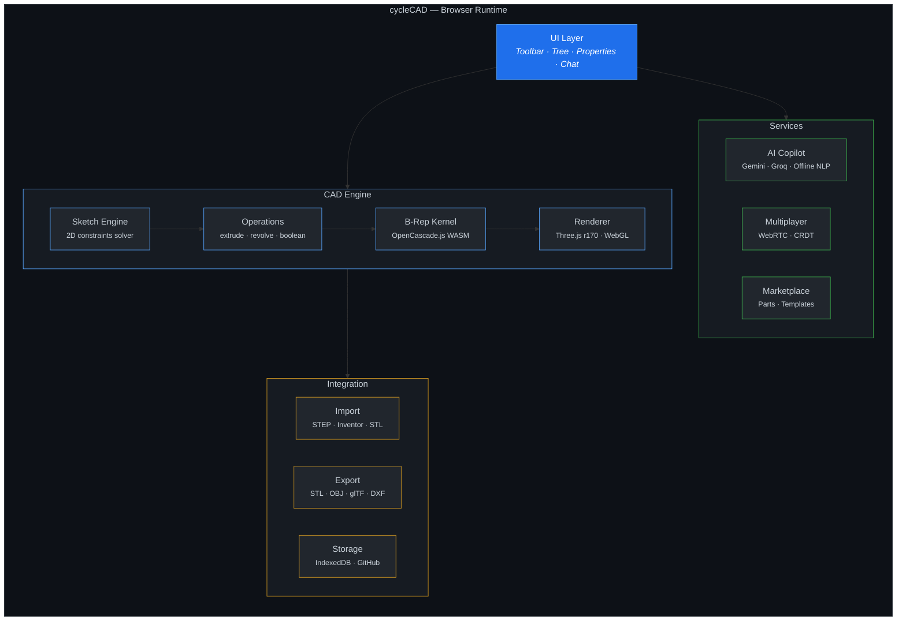

<div align="center">

# cycleCAD

**The open-source browser CAD that understands English.**

Type `motor mount plate with 4 bolt holes` and get a real 3D solid in 5 seconds.
No install. No login. Free forever.

<a href="https://www.npmjs.com/package/cyclecad"></a>&nbsp;
<a href="https://github.com/vvlars-cmd/cyclecad/stargazers"></a>&nbsp;
<a href="https://opensource.org/licenses/MIT"></a>&nbsp;
<a href="https://cyclecad.com/app/"></a>

<br>

<a href="https://cyclecad.com/app/">
  
</a>

<br>

<a href="https://cyclecad.com/app/"><b>Open App</b></a>&nbsp;&nbsp;&bull;&nbsp;&nbsp;<a href="https://github.com/vvlars-cmd/cyclecad">Source Code</a>&nbsp;&nbsp;&bull;&nbsp;&nbsp;<a href="https://cyclecad.com/docs">Docs</a>

</div>

<br>

## Why cycleCAD

| | **cycleCAD** | OnShape | Fusion 360 | FreeCAD |
|:--|:--|:--|:--|:--|
| **Runs in browser** | Yes, zero install | Cloud-dependent | Desktop app | Desktop app |
| **Cost** | Free, MIT licensed | $1,500/yr | $545/yr | Free |
| **Text-to-CAD** | Built-in AI copilot | — | — | — |
| **Multiplayer** | WebRTC peer-to-peer | Paid add-on | — | — |
| **Inventor files** | Opens .ipt and .iam natively | — | Yes | — |
| **B-rep kernel** | OpenCascade.js WASM | Parasolid | Parasolid | OpenCascade |
| **Mobile** | Touch-optimized viewer | — | — | — |
| **Open source** | MIT | Proprietary | Proprietary | LGPL |

<br>

## Get Started in 30 Seconds

**Option 1 — Browser** (no install):
Open [**cyclecad.com/app**](https://cyclecad.com/app/) and start designing.

**Option 2 — Local**:
```bash
npm install -g cyclecad && cyclecad
```

**Option 3 — Clone**:
```bash
git clone https://github.com/vvlars-cmd/cyclecad.git
cd cyclecad && npm run dev
```

<br>

## Text-to-CAD

Talk to cycleCAD like you'd talk to a colleague.

```
> create a motor mount plate 100mm wide, 80mm tall
  [solid rectangular prism appears]

> add 4 bolt holes in corners, 10mm diameter
  [holes cut through the plate at each corner]

> fillet all edges 2mm
  [edges rounded — part is ready to manufacture]
```

The AI understands shapes, features, patterns, materials, booleans, and constraints. It works offline too — no API key required for basic geometry.

<br>

## Architecture



**Zero dependencies.** Core app is ~22KB gzipped. Three.js, OpenCascade WASM, and AI models load on demand from CDN.

<br>

## Features

**Modeling** — Parametric sketcher with 12 constraint types, extrude, revolve, sweep, loft, shell, fillet, chamfer, boolean union/cut/intersect, linear/circular/mirror patterns, threads, draft angles.

**Analysis** — Distance and angle measurement, mass properties, DFM checks, stress heatmap, clearance detection, assembly validation with scoring.

**AI** — Text-to-CAD with natural language, part identification from geometry, manufacturing cost estimation, auto-generated rebuild guides, maintenance scheduling, smart BOM with McMaster-Carr links.

**Export** — STL (ASCII and binary), OBJ, glTF 2.0, STEP, DXF, PDF engineering drawings. Direct slicer integration for 3D printing. G-code preview for CNC.

**Platform** — Works in Chrome, Safari, Firefox, Edge. Offline via IndexedDB. Mobile touch viewer. Git-style version history. Embeddable 3D viewer widget. 50+ keyboard shortcuts.

<br>

## Multiplayer

Create a room, share the code, design together in real-time.

```javascript
const room = await cyclecad.createRoom();   // "ABC123"
await cyclecad.joinRoom("ABC123");          // teammate joins
// See each other's cursors, watch live edits, chat in-viewport
```

Peer-to-peer via WebRTC. No server required. Conflict-free CRDT sync.

<br>

## Parts Library

35+ built-in parametric parts (bearings, fasteners, motors, structural). Community marketplace for publishing, selling, and remixing designs with 70–90% creator royalties.

```bash
cyclecad install bearing-6205
cyclecad install fastener-M5-hex-socket
cyclecad install motor-nema23
```

<br>

## Contributing

```bash
git clone https://github.com/vvlars-cmd/cyclecad.git
cd cyclecad && npm run dev    # opens on localhost:3000
```

Pick an issue labeled `good-first-issue`, make your changes, open a PR with before/after screenshots. We especially need help with UI polish, AI improvements, mobile interactions, testing, and translations.

<br>

## License

MIT © [Sachin Kumar](https://github.com/vvlars-cmd) — free for any use, commercial or personal.

---

<div align="center">
  <a href="https://cyclecad.com/app/"><b>Open cycleCAD</b></a>
  <br><br>
  <sub>Built for <a href="https://cyclewash.com">cycleWASH</a> — a real production machine with 400+ parts.</sub>
</div>
